WYŻSZA SZKOŁA ZARZĄDZANIA I BANKOWOŚCI W KRAKOWIE 

Wydział Nauk Stosowanych 

KIERUNEK: Informatyka Stosowana 

ZAKRES KSZTAŁCENIA: Software engineering i produkcja oprogramowania 

PRACA DYPLOMOWA 

Michał Jerzy Kubera 

Współczesne metody zabezpieczenia witryn internetowych przed botami spamerskimi 
 

PROMOTOR: 

dr inż. Darin Nikolow 

KRAKÓW 2026
SPIS TRESCI 

​​ 

​ 

​ 

​ 

​ 

​ 

​ 

​ 

​ 

​ 

​ 

​ 

​ 

​​ 

 

Streszczenie pracy 

Celem niniejszej pracy jest analiza nowoczesnych rozwiązań służących ochronie aplikacji internetowych przed zautomatyzowanymi atakami botów spamerskich. Impulsem do podjęcia tematu jest rosnąca dostępność zaawansowanych modeli sztucznej inteligencji, które mogą być wykorzystywane do analizy zachowań użytkowników w środowisku webowym, a tym samym stanowić skuteczny mechanizm zwiększający poziom bezpieczeństwa oraz stabilności aplikacji internetowych. 

Głównym aspektem pracy jest zbadanie możliwości wykorzystania sztucznej inteligencji do analizy danych sieciowych oraz logiki zapytań HTTP w celu identyfikacji i blokowania zautomatyzowanych ataków. Szczególną uwagę poświęcono analizie wpływu skalowania infrastruktury ataku na efektywność zastosowanych mechanizmów zabezpieczających oraz ocenie skuteczności modelu sztucznej inteligencji w warunkach zwiększonego obciążenia. 

W części eksperymentalnej przygotowano zamknięte, skalowalne środowisko testowe oparte na technologii konteneryzacji. W środowisku tym uruchomiono rozproszone instancje botów spamerskich symulujących zautomatyzowany atak na aplikację internetową. Aplikacja webowa została wdrożona w odseparowanym kontenerze oraz zintegrowana z modelem sztucznej inteligencji odpowiedzialnym za analizę ruchu i wykrywanie podejrzanych wzorców zachowań. 

Liczba botów oraz ich podstawowa konfiguracja stanowiły wartość stałą, natomiast zmienną badawczą były mechanizmy zabezpieczające oraz konfiguracja modelu sztucznej inteligencji. Celem badań było określenie skuteczności opracowanego rozwiązania w zależności od przyjętych parametrów ochrony oraz warunków obciążeniowych. 

 

Abstract 

The aim of this thesis is to analyze modern solutions for protecting web applications against automated spam bot attacks. The motivation for undertaking this research stems from the increasing availability of advanced artificial intelligence models, which can be used to analyze user behavior in web environments and thereby serve as effective mechanisms for enhancing the security and stability of web applications. 

The main focus of this work is to examine the potential of artificial intelligence in analyzing network traffic data and HTTP request logic in order to detect and mitigate automated attacks. Particular attention is given to evaluating the impact of scaling the attack infrastructure on the effectiveness of implemented security mechanisms, as well as assessing the performance of the artificial intelligence model under increased load conditions. 

In the experimental part of the study, a closed and scalable test environment based on containerization technology was prepared. Within this environment, distributed instances of spam bots were deployed to simulate automated attacks targeting a web application. The web application was deployed in an isolated container and integrated with an artificial intelligence model responsible for traffic analysis and suspicious behavior detection. 

The number of bots and their baseline configuration remained constant, while the security mechanisms and the configuration of the artificial intelligence model constituted the independent research variables. The objective of the experiments was to determine the effectiveness of the proposed solution depending on the selected protection parameters and system load conditions. 

 

1. Wstęp 

Dynamiczny rozwój technologii informatycznych oraz rosnąca dostępność narzędzi sztucznej inteligencji istotnie wpływają na sposób funkcjonowania współczesnych aplikacji internetowych. Internetowe systemy informatyczne stanowią obecnie podstawę działalności wielu przedsiębiorstw, instytucji publicznych oraz platform usługowych. Wraz ze wzrostem ich znaczenia zwiększa się również potrzeba zapewnienia wysokiego poziomu bezpieczeństwa, niezawodności oraz odporności na zagrożenia wynikające z automatyzacji ruchu sieciowego. Jednym z istotnych problemów pozostają zautomatyzowane działania realizowane przez boty spamerskie, które mogą zakłócać funkcjonowanie aplikacji internetowych. 

Szczególnym wyzwaniem dla bezpieczeństwa aplikacji webowych jest rosnąca skala i złożoność ruchu generowanego w środowiskach sieciowych. Współczesne aplikacje są zmuszone obsługiwać dużą liczbę równoczesnych zapytań, przy jednoczesnym zachowaniu wysokiej dostępności usług dla użytkowników. W takich warunkach tradycyjne metody ochronne mogą się okazać niewystarczające lub negatywnie wpływać na stabilność aplikacji webowej a co się z tym wiąże na komfort korzystania z aplikacji. 

W odpowiedzi na te wyzwania coraz większe znaczenie zyskują rozwiązania oparte na zastosowaniu sztucznej inteligencji, umożliwiające analizę, danych sieciowych czy logikę zapytań HTTP. Modele sztucznej inteligencji tym samym mogą posłużyć nam w analizie, której zadaniem będzie identyfikacja nietypowych wzorców aktywności w sposób adaptacyjny i dynamiczny. 

W kontekście rosnącej liczby zagrożeń oraz dynamicznie zmieniających się warunków pracy aplikacji internetowych zasadne jest przeprowadzenie analizy skuteczności mechanizmów ochronnych wspieranych przez sztuczną inteligencję. Niniejsza praca podejmuje próbę zbadania tego zagadnienia w kontrolowanym, skalowalnym środowisku eksperymentalnym, umożliwiającym ocenę działania modelu w warunkach zwiększonego obciążenia. 

1.1 Cel pracy 

Celem niniejszej pracy była analiza skuteczności nowoczesnych metod ochrony aplikacji internetowych przed zautomatyzowanymi atakami botów spamerskich z wykorzystaniem modelu sztucznej inteligencji. 

W ramach pracy stworzone zostało zamknięte środowisko badawcze umożliwiające symulację ataku cybernetycznego na aplikację internetową. W środowisku tym zastosowano model sztucznej inteligencji pełniący funkcję analizatora danych generowanych w obrębie witryny, który na podstawie analizy ruchu sieciowego oraz wzorców zapytań podejmował działania zapobiegające atakom. Zaimplementowano również boty spamerskie stanowiące stały, kontrolowany model ataku na aplikację webową, a także samą aplikację internetową poddaną testom.  

W celu stworzenia izolowanego i w pełni kontrolowanego środowiska testowego wykorzystano technologię Kubernetes, umożliwiając zarządzanie konteneryzowanymi komponentami systemu. Zastosowanie tej technologii pozwoliło nie tylko na zapewnienie separacji poszczególnych elementów infrastruktury, lecz również na uzyskanie skalowalności środowiska — zarówno w zakresie liczby instancji botów, komponentów modelu sztucznej inteligencji, jak i samej aplikacji webowej. 

Utworzone środowisko posłużyło do przeprowadzenia badań nad skutecznością modelu sztucznej inteligencji jako mechanizmu ochrony aplikacji internetowej przed botami spamerskimi. Zmienną badawczą była konfiguracja modelu sztucznej inteligencji oraz zastosowane metody ochrony witryny, natomiast elementem stałym pozostawał zestaw botów spamerskich generujących ruch testowy. Skuteczność opracowanego rozwiązania oceniano na podstawie określonych metryk, takich jak wykrywalność zautomatyzowanego ruchu, odporność systemu na zwiększone obciążenie oraz wpływ zastosowanych zabezpieczeń na dostępność i stabilność aplikacji. 

1.2 Zawartość pracy 

W pracy przedstawiono teoretyczne podstawy związane z wykorzystaniem sztucznej inteligencji w kontekście cyberbezpieczeństwa, wraz ze szczególnym uwzględnieniem automatyzacji ataków na aplikacje internetowe. Omówiono również współczesne zagrożenia wynikające z wykorzystania botów oraz techniki ich wykrywania i neutralizacji.  

Kolejna część pracy obejmuje opis środowiska badawczego, wykorzystane technologie oraz sposób konfiguracji systemu opartego kontenerach. Szczegółowe przedstawienie mechanizmów działania agentów sztucznej inteligencji oraz zastosowanie metod ochronnych w testowanej aplikacji. 

W części eksperymentalnej zaprezentowano przebieg przeprowadzonych testów, zastosowaną metodologię badawczą oraz analizę uzyskanych wyników. Ostatni rozdział zawiera podsumowanie rezultatów, ocenę skuteczności badanych mechanizmów ochronnych oraz propozycje dalszych kierunków badań w obszarze zabezpieczania aplikacji internetowych przed atakami wspieranymi przez sztuczną inteligencje.  

2. Istniejące metody ochrony aplikacji webowych 

W tym rozdziale przedstawiono istniejące rozwiązania technologiczne stosowane w ochronie aplikacji webowych przed atakami cybernetycznymi. Wraz z rozwojem technologii oraz rosnącą zaawansowaniem botów spamerskich, tradycyjne metody zabezpieczania witryn internetowych musiały ulec dostosowaniu, aby skutecznie przeciwdziałać nowym formom zautomatyzowanych zagrożeń. 

2.1 Metody ochrony aplikacji webowych przed botami spamerskimi 

Rynek aplikacji samochodowych nie jest ukierunkowany na aspekty wyszczególnione w mojej pracy, takie jak prowadzenie dokumentacji oraz zapis zdarzeń dla danego pojazdu. Popularne aplikacje wprowadzane na rynek głównie skupiają się na poprawie komfortu kierowcy poprzez dostarczaniu informacji o zdarzeniach znajdujących się na drodze.  

2.1.1 reCAPTCHA 

reCAPTCHA jest jednym z najczęściej stosowanych mechanizmów weryfikacji użytkownika, mającym na celu odróżnienie człowieka od bota. System ten opiera się na analizie zachowań użytkownika, takich jak sposób poruszania myszką czy czas interakcji z formularzem, a także na klasycznych zadaniach typu „kliknij wszystkie obrazki zawierające…”. Dzięki dynamicznemu dostosowywaniu poziomu trudności, reCAPTCHA utrudnia automatyczne wypełnianie formularzy przez boty. Jednocześnie rozwiązanie to jest stosunkowo łatwe do wdrożenia w aplikacjach webowych, co czyni je popularnym wyborem wśród deweloperów. 

2.1.2 Ograniczenie liczby zapytań (Rate Limiting) 

Ograniczenie liczby zapytań do serwera w określonym czasie jest jedną z podstawowych metod ochrony przed zautomatyzowanym ruchem. Poprzez kontrolowanie częstotliwości wysyłania żądań, mechanizm ten pozwala na ograniczenie możliwości masowego przesyłania formularzy czy prób logowania, minimalizując skutki działań botów. Dodatkowo, system może wykrywać nadmierną aktywność z określonych adresów IP i tymczasowo blokować podejrzane źródła. Metoda ta jest efektywna w prostych scenariuszach ataków, jednak może być mniej skuteczna wobec botów wykorzystujących zmienne adresy IP lub rozproszone infrastruktury. 

2.1.3 Wykrywanie anomalii ruchu sieciowego 

Systemy wykrywania anomalii analizują ruch sieciowy pod kątem nietypowych wzorców, takich jak powtarzalne zapytania z tego samego adresu IP czy nagłe skoki liczby żądań. Mechanizmy te mogą automatycznie blokować podejrzany ruch lub kierować go do dodatkowej weryfikacji, co zwiększa odporność aplikacji na zautomatyzowane ataki. Analiza anomalii pozwala również na identyfikację nowych, wcześniej nieznanych sposobów działania botów. W połączeniu z innymi mechanizmami ochronnymi, metoda ta znacząco podnosi bezpieczeństwo aplikacji webowych. 

2.1.4 Weryfikacja sesji i tokeny CSRF 

Stosowanie tokenów CSRF (Cross-Site Request Forgery) oraz mechanizmów weryfikacji sesji pozwala na ograniczenie ryzyka wykorzystania aplikacji przez nieautoryzowane boty. Tokeny generowane dla każdej sesji uniemożliwiają automatyczne wysyłanie żądań z zewnątrz i wymagają interakcji użytkownika, co utrudnia przeprowadzanie zautomatyzowanych ataków. Mechanizmy te zwiększają integralność sesji użytkownika oraz zapobiegają manipulacjom w danych przesyłanych w formularzach. Są one szczególnie przydatne w aplikacjach webowych przetwarzających poufne dane lub umożliwiających wykonywanie operacji finansowych. 

2.2 Analiza współczesnych metod ochrony 

Przedstawione metody ochrony aplikacji webowych przed botami spamerskimi, takie jak reCAPTCHA, ograniczenie liczby zapytań, wykrywanie anomalii ruchu sieciowego czy weryfikacja sesji i tokeny CSRF, mają wspólny cel: zapewnienie bezpieczeństwa aplikacji poprzez odróżnienie ruchu legalnego od zautomatyzowanego. 

Czynnikami wspólnymi wszystkich metod jest prewencja, monitorowanie oraz ograniczanie skutków ataków. Mechanizmy te dążą do minimalizacji ryzyka związanego z masowym ruchem botów, ochrony integralności danych oraz utrzymania dostępności aplikacji dla prawdziwych użytkowników. Ponadto każda z metod wymaga ciągłego dostosowywania do nowych technik wykorzystywanych przez boty — co oznacza, że skuteczna ochrona aplikacji webowej jest procesem dynamicznym, a nie jednorazowym działaniem.
 

Analiza tych metod pokazuje również, że tradycyjne podejścia, oparte głównie na prostych filtrach czy ograniczeniach ilościowych, mogą być niewystarczające wobec coraz bardziej zaawansowanych botów. W związku z tym coraz większe znaczenie zyskują rozwiązania adaptacyjne i inteligentne, które wykorzystują analizę wzorców zachowań i uczenie maszynowe do przewidywania oraz blokowania niepożądanego ruchu w czasie rzeczywistym.  

2.3 Kierunki rozwoju metod ochrony 

Współczesne metody ochrony aplikacji webowych ewoluują w kierunku rozwiązań adaptacyjnych i inteligentnych, które potrafią wykrywać zautomatyzowany ruch w czasie rzeczywistym. Coraz większe znaczenie zyskują systemy oparte na sztucznej inteligencji i uczeniu maszynowym, które analizują wzorce zachowań użytkowników i potrafią odróżnić boty od prawdziwych użytkowników nawet w przypadku wyrafinowanych ataków. 

Równocześnie obserwuje się wzrost zainteresowania rozproszonymi mechanizmami detekcji, które monitorują ruch w wielu punktach aplikacji oraz integrują informacje z różnych źródeł, co pozwala szybciej reagować na nowe zagrożenia. Istotnym trendem jest także analiza behawioralna, która zamiast bazować wyłącznie na statycznych regułach, uczy się charakterystycznych wzorców interakcji użytkowników, co zwiększa skuteczność wykrywania botów. 

W przyszłości oczekuje się dalszego rozwoju systemów hybrydowych, łączących tradycyjne metody ochrony z inteligentnymi mechanizmami predykcyjnymi. Takie podejście pozwoli nie tylko na skuteczniejszą ochronę aplikacji, ale także na minimalizację wpływu zabezpieczeń na doświadczenie prawdziwych użytkowników. Trendy te wskazują, że skuteczna ochrona aplikacji webowych stanie się coraz bardziej zależna od połączenia prewencji, monitorowania i adaptacyjnych mechanizmów wykrywania.
 

3. Architektura środowiska testowego 

Niniejszy rozdział przedstawia architekturę zaprojektowanego środowiska badawczego, jego poszczególne komponenty oraz wzajemne zależności pomiędzy nimi. Środowisko zostało zaprojektowane jako zamknięty, w pełni izolowany i skalowalny system, którego celem jest umożliwienie powtarzalnych eksperymentów nad skutecznością mechanizmów ochrony aplikacji webowej przed zautomatyzowanym ruchem generowanym przez boty spamerskie. 

3.1 Założenia projektowe 

Podstawowe znaczenie przy projektowaniu środowiska miały jego izolacja oraz powtarzalność. Wszystkie komponenty działają w odseparowanym klastrze Kubernetes i nie oddziałują na sieci zewnętrzne, a ruch generowany przez boty nigdy nie opuszcza granic klastra, co zapewnia zarówno bezpieczeństwo, jak i etyczność prowadzonego eksperymentu. Aby możliwe było ponadto wierne odtworzenie całego środowiska na dowolnej maszynie, jego konfigurację opisano w sposób w pełni deklaratywny, w postaci manifestów Kubernetes oraz obrazów kontenerów. 

Równie istotna była skalowalność oraz wyraźne oddzielenie zmiennej badawczej od elementu stałego. Liczba instancji botów i komponentów ochronnych może być zmieniana w trakcie działania systemu za pomocą mechanizmu replik, dzięki czemu możliwe stało się badanie wpływu skali ataku na skuteczność ochrony. Sam atak, czyli zbiór botów wraz z ich konfiguracją, stanowi przy tym stały element eksperymentu, podczas gdy zmienną badawczą pozostaje zastosowana strategia ochrony oraz konfiguracja modelu sztucznej inteligencji. 

Całość zaprojektowano wreszcie z myślą o pełnej obserwowalności, dzięki czemu każdy element systemu udostępnia metryki pozwalające na ilościową ocenę jego działania w czasie rzeczywistym. 

3.2 Ogólny schemat systemu 

Architektura systemu opiera się na wzorcu odwrotnego serwera pośredniczącego (ang. reverse proxy). Cały ruch kierowany do aplikacji webowej przechodzi przez warstwę ochronną, która pełni rolę analizatora oraz punktu decyzyjnego, podejmując na podstawie cech żądania HTTP decyzję o przepuszczeniu żądania do aplikacji właściwej bądź o jego zablokowaniu. Ogólny schemat systemu, obejmujący rozmieszczenie komponentów oraz przepływ pojedynczego żądania, przedstawia rysunek 3.1. 

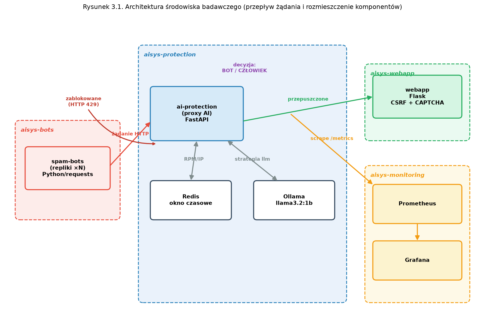 

Rysunek 3.1 Architektura środowiska badawczego — przepływ żądania oraz rozmieszczenie komponentów w przestrzeniach nazw Kubernetes 

Przepływ pojedynczego żądania przebiega następująco. Bot spamerski wysyła żądanie HTTP do usługi warstwy ochronnej, która w pierwszej kolejności wyznacza zestaw cech tego żądania, obejmujący między innymi częstotliwość zapytań z danego adresu IP, nagłówek User-Agent, obecność nagłówków przeglądarkowych oraz rozmiar przesyłanej treści. Na podstawie tych cech wybrana strategia detekcji oblicza wynik prawdopodobieństwa (ang. score) określający, czy żądanie pochodzi od bota. Jeżeli wyznaczony wynik przekracza ustalony próg, żądanie zostaje odrzucone z kodem HTTP 429 (Too Many Requests); w przeciwnym razie jest ono przekazywane do aplikacji webowej, a zwrócona przez nią odpowiedź trafia z powrotem do klienta. Niezależnie od podjętej decyzji odpowiednie metryki są rejestrowane w systemie monitoringu. 

3.3 Komponenty systemu 

System składa się z sześciu zasadniczych komponentów, rozmieszczonych w czterech logicznych przestrzeniach nazw (ang. namespaces) Kubernetes, co zapewnia ich wzajemną izolację. W kolejnych podrozdziałach scharakteryzowano każdy z tych komponentów. 

3.3.1 Aplikacja webowa 

Aplikacja webowa stanowi cel ataku i reprezentuje typową witrynę zawierającą formularze. Została zaimplementowana w języku Python z wykorzystaniem mikroframeworka Flask i udostępnia stronę główną z formularzami kontaktowym oraz logowania, a także punkty końcowe `/contact`, `/login` i `/register` przyjmujące dane metodą POST. Implementuje ona dwa klasyczne mechanizmy ochrony omówione w rozdziale 2: token CSRF generowany dla każdej sesji oraz proste zadanie typu CAPTCHA w postaci działania arytmetycznego. Każde żądanie POST jest weryfikowane pod kątem poprawności tokenu CSRF oraz odpowiedzi CAPTCHA, a w przypadku niezgodności zostaje odrzucone z kodem HTTP 403. Mechanizmy te odzwierciedlają stan typowej, klasycznie zabezpieczonej aplikacji, na którą nakładana jest dodatkowa, badana warstwa ochrony oparta na sztucznej inteligencji. Wygląd aplikacji wraz z formularzami oraz zadaniem CAPTCHA przedstawia rysunek 3.2. 

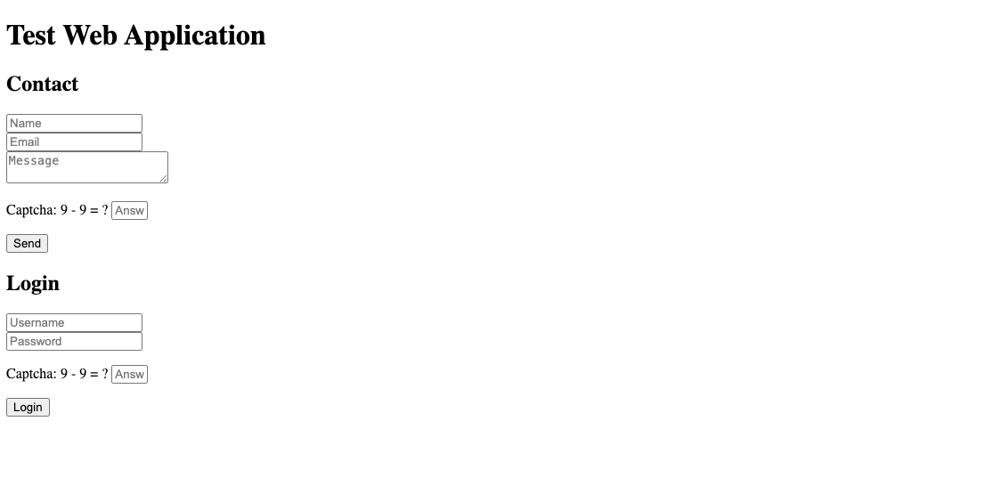 

Rysunek 3.2 Aplikacja webowa stanowiąca cel ataku — formularze kontaktowy i logowania zabezpieczone tokenem CSRF oraz zadaniem CAPTCHA 

3.3.2 Warstwa ochronna (proxy AI) 

Warstwa ochronna jest kluczowym, badanym elementem systemu i została zaimplementowana w postaci asynchronicznego serwera pośredniczącego z wykorzystaniem frameworka FastAPI oraz serwera ASGI Uvicorn. Komponent ten realizuje dwie funkcje, czyli analizę przychodzących żądań oraz — w przypadku ich akceptacji — przekazywanie ich do aplikacji webowej. Jego sercem jest moduł analizatora (`RequestAnalyzer`), który dla każdego żądania wyznacza wektor cech, a następnie, w zależności od aktywnej strategii, klasyfikuje żądanie jako pochodzące od człowieka lub od bota. Wyznaczane cechy obejmują adres IP klienta, metodę i ścieżkę żądania, nagłówek User-Agent, typ zawartości, liczbę żądań na minutę z danego adresu IP przechowywaną w bazie Redis, obecność nagłówków `Accept` i `Accept-Language` oraz rozmiar treści żądania. Przykładowy dziennik zdarzeń warstwy ochronnej, ilustrujący decyzje podejmowane dla kolejnych żądań HTTP, przedstawia rysunek 3.3. 

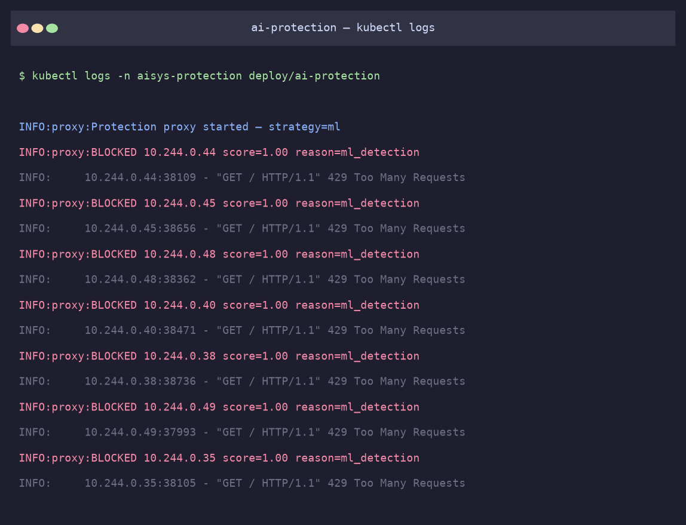 

Rysunek 3.3 Dziennik zdarzeń warstwy ochronnej — decyzje podejmowane dla kolejnych żądań HTTP wraz z wyznaczonym wynikiem (score) oraz przyczyną blokady 

3.3.3 Boty spamerskie 

Boty spamerskie stanowią stały, kontrolowany model ataku i również zostały zaimplementowane w języku Python, z wykorzystaniem biblioteki `requests`. Każda instancja bota uruchamia konfigurowalną liczbę wątków, z których każdy posiada własną sesję HTTP, a więc własne ciasteczka i token CSRF. Boty zaprojektowano w wariancie zaawansowanym, ponieważ przed wysłaniem żądania POST bot pobiera stronę główną, parsuje kod HTML w poszukiwaniu tokenu CSRF oraz treści zadania CAPTCHA, rozwiązuje działanie arytmetyczne i dołącza poprawne wartości do żądania. Dzięki temu skutecznie omijają one klasyczne mechanizmy ochrony aplikacji, co odzwierciedla realne zagrożenie ze strony współczesnych, zautomatyzowanych narzędzi i pozwala skupić ocenę skuteczności na badanej warstwie sztucznej inteligencji, a nie na zabezpieczeniach klasycznych. Boty obsługują trzy typy ataku, którymi są masowe wysyłanie formularzy (`form_spam`), atak słownikowy na logowanie (`login_bruteforce`) oraz tryb mieszany (`mixed`). Przykładowy dziennik pracy botów w trakcie ataku, wraz ze zwracanymi przez warstwę ochronną kodami odpowiedzi, przedstawia rysunek 3.4. 

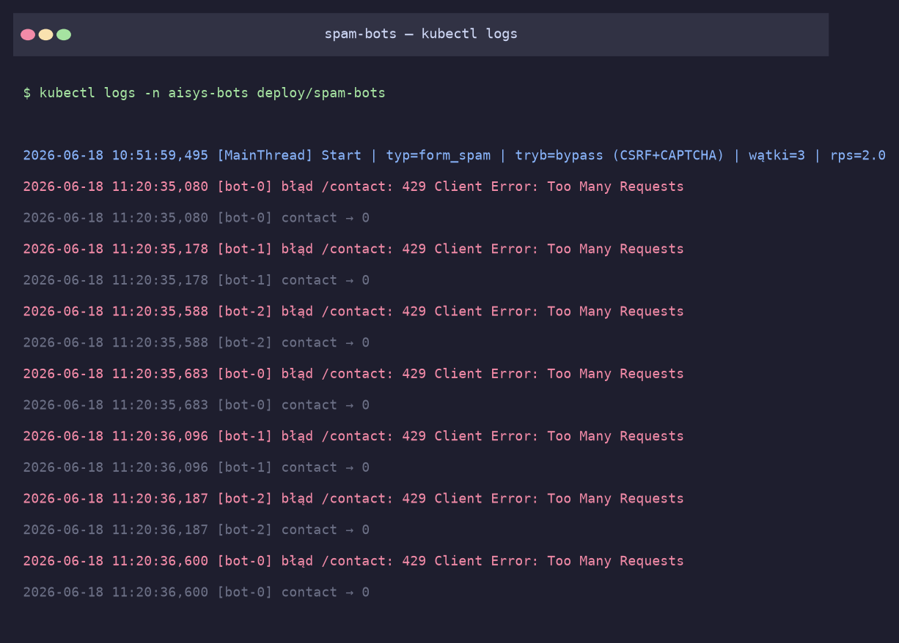 

Rysunek 3.4 Dziennik zdarzeń botów spamerskich — kolejne próby wysłania formularza (`/contact`) odrzucane przez warstwę ochronną kodem HTTP 429 (Too Many Requests) 

3.3.4 Magazyn stanu — Redis 

Magazyn stanu zapewnia baza Redis, która pełni rolę szybkiego, ulotnego repozytorium współdzielonego pomiędzy instancjami warstwy ochronnej. Wykorzystywana jest ona do implementacji okna czasowego zliczającego liczbę żądań z danego adresu IP w jednominutowych przedziałach, czyli mechanizmu okna przesuwnego. Dzięki centralizacji tego licznika w bazie Redis mechanizm ograniczania liczby zapytań działa spójnie nawet przy skalowaniu warstwy ochronnej do wielu replik. Zawartość bazy Redis z kluczami okna przesuwnego, tworzonymi dla poszczególnych adresów IP, przedstawia rysunek 3.5. 

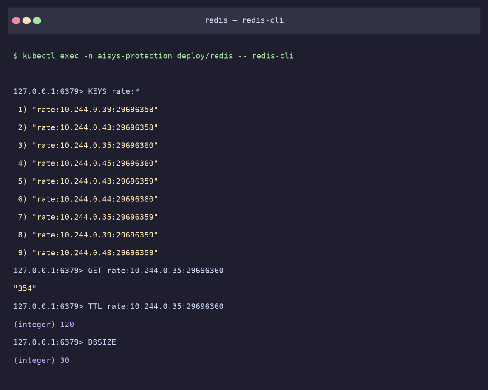 

Rysunek 3.5 Zawartość bazy Redis — klucze okna przesuwnego (`rate:<ip>:<minuta>`) zliczające liczbę żądań z poszczególnych adresów IP w jednominutowych przedziałach 

3.3.5 Model językowy — Ollama 

Lokalny model sztucznej inteligencji udostępnia serwer Ollama, na którym uruchomiono model `llama3.2:1b` o rozmiarze około 600 MB i miliardzie parametrów, wykorzystywany przez strategię opartą na dużym modelu językowym. Model działa w pełni lokalnie, w obrębie klastra, bez dostępu do internetu po pierwszym pobraniu oraz bez kosztów licencyjnych i bez konieczności posiadania klucza API. Warstwa ochronna komunikuje się z nim poprzez interfejs REST, przesyłając cechy żądania w formacie tekstowym i oczekując odpowiedzi w postaci klasyfikacji (BOT lub HUMAN) wraz z wynikiem liczbowym. Zastosowanie modelu lokalnego zapewnia przy tym powtarzalność eksperymentu oraz pełną kontrolę nad środowiskiem. Przykładową odpowiedź modelu, zwróconą przez serwer Ollama dla pojedynczego żądania, przedstawia rysunek 3.6. 

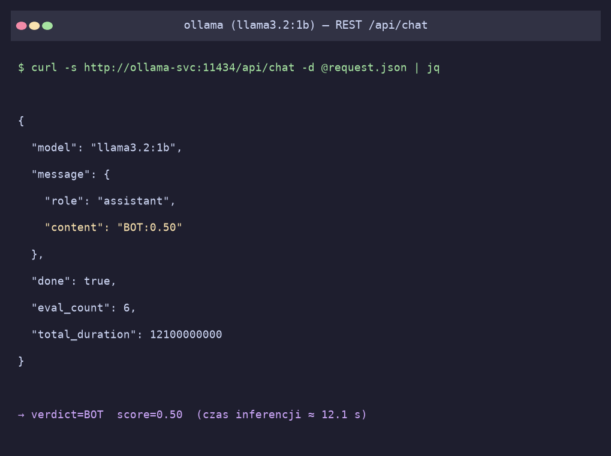 

Rysunek 3.6 Odpowiedź lokalnego modelu językowego (Ollama, `llama3.2:1b`) — klasyfikacja żądania w postaci `BOT:<score>` lub `HUMAN:<score>` zwrócona poprzez interfejs REST 

3.3.6 Warstwa monitoringu — Prometheus i Grafana 

Obserwowalność systemu zapewnia para narzędzi w postaci Prometheusa oraz Grafany. Warstwa ochronna udostępnia metryki w formacie Prometheus pod ścieżką `/metrics`, którą Prometheus cyklicznie, co dziesięć sekund, odpytuje, gromadząc dane w wewnętrznej bazie szeregów czasowych, natomiast Grafana wizualizuje zgromadzone metryki w postaci interaktywnego pulpitu (ang. dashboard) odświeżanego również co dziesięć sekund. Rejestrowane są przy tym trzy zasadnicze metryki, czyli licznik żądań z podziałem na wynik (`proxy_requests_total`), histogram opóźnienia detekcji (`proxy_detection_latency_seconds`) oraz licznik blokad z podziałem na metodę detekcji (`proxy_blocked_by_method_total`). Przykładową konsolę Prometheusa z wynikami zapytań PromQL — tempem żądań w podziale na wynik oraz tempem blokad według metody detekcji w funkcji czasu — przedstawia rysunek 3.7. 

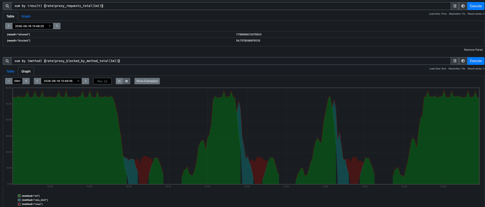 

Rysunek 3.7 Konsola Prometheusa — wyniki zapytań PromQL: tempo żądań w podziale na wynik (allowed/blocked) oraz tempo blokad według metody detekcji w funkcji czasu 

3.4 Strategie detekcji 

W ramach warstwy ochronnej zaimplementowano cztery strategie detekcji, które stanowią zmienną badawczą eksperymentu i mogą być zmieniane w czasie działania systemu poprzez modyfikację mapy konfiguracyjnej (ang. ConfigMap), bez konieczności przebudowy obrazów. We wszystkich strategiach, z wyjątkiem progowego ograniczania liczby zapytań, żądanie jest blokowane wówczas, gdy wyznaczony wynik przekroczy konfigurowalny próg detekcji, wynoszący domyślnie 0,7. 

3.4.1 Ograniczanie liczby zapytań 

Najprostszą z badanych strategii jest ograniczanie liczby zapytań (`rate_limit`), które blokuje żądania w momencie, gdy liczba zapytań z danego adresu IP w ciągu minuty przekroczy ustalony próg, wynoszący domyślnie 60. Rozwiązanie to reprezentuje klasyczną metodę ochrony opisaną w rozdziale 2. 

3.4.2 Detekcja heurystyczna 

Bardziej rozbudowanym podejściem jest detekcja heurystyczna (`rules`), opierająca się na zbiorze reguł. Wynik prawdopodobieństwa bota stanowi w niej sumę wag przypisanych poszczególnym przesłankom, takim jak wysoka częstotliwość zapytań, charakterystyczny nagłówek User-Agent (na przykład `python-requests` czy `curl`) oraz brak typowych dla przeglądarek nagłówków `Accept` i `Accept-Language`. 

3.4.3 Uczenie maszynowe 

Znacznie bardziej zaawansowane jest rozwiązanie wykorzystujące uczenie maszynowe (`ml`) w postaci klasyfikatora lasu losowego (ang. Random Forest), wytrenowanego na syntetycznym zbiorze danych odwzorowującym charakterystyki ruchu generowanego przez ludzi i przez boty. Model ten wyznacza prawdopodobieństwo, że żądanie pochodzi od bota, na podstawie pięciu cech liczbowych. 

3.4.4 Model językowy 

Najbardziej złożona spośród badanych strategii deleguje decyzję do lokalnego modelu językowego (`llm`) uruchomionego w środowisku Ollama (`llama3.2:1b`), który na podstawie tekstowego opisu cech żądania dokonuje klasyfikacji binarnej. 

3.5 Topologia Kubernetes 

Komponenty systemu rozmieszczono w czterech przestrzeniach nazw: `aisys-webapp` (aplikacja webowa), `aisys-protection` (warstwa ochronna, Redis oraz Ollama), `aisys-bots` (boty spamerskie) oraz `aisys-monitoring` (Prometheus i Grafana). Każdy komponent uruchamiany jest jako obiekt typu Deployment, a komunikacja pomiędzy nimi odbywa się poprzez wewnętrzne usługi (Service) wykorzystujące mechanizm DNS klastra. Parametry działania komponentów przekazywane są poprzez mapy konfiguracyjne (ConfigMap), co umożliwia ich modyfikację bez przebudowy obrazów. Tabela 3.1 podsumowuje rozmieszczenie komponentów. 

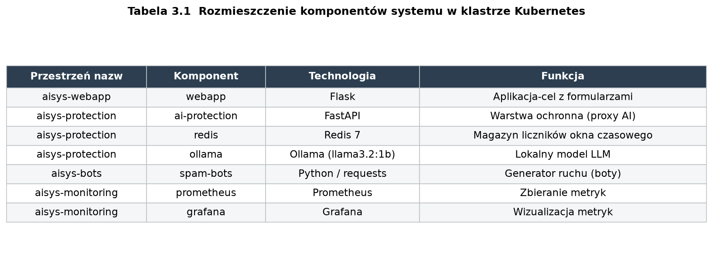 

Tabela 3.1 Rozmieszczenie komponentów systemu w klastrze Kubernetes 

4. Wdrożenie i konfiguracja środowiska testowego 

Rozdział ten opisuje proces wdrożenia środowiska badawczego oraz sposób jego konfiguracji na potrzeby przeprowadzenia eksperymentów. Przedstawiono również metodykę pomiaru oraz scenariusze badawcze. 

4.1 Wymagania i narzędzia 

Środowisko zostało uruchomione lokalnie z wykorzystaniem narzędzia minikube, które tworzy jednowęzłowy klaster Kubernetes wewnątrz kontenera Docker. Wybór rozwiązania lokalnego, zamiast klastra chmurowego, był podyktowany dążeniem do pełnej kontroli nad środowiskiem, jego całkowitej izolacji od sieci zewnętrznych oraz brakiem kosztów związanych z infrastrukturą, przy jednoczesnym zachowaniu pełnej zgodności z mechanizmami produkcyjnego Kubernetes. 

Do obsługi środowiska wykorzystano trzy podstawowe narzędzia. Pierwszym z nich jest Docker, czyli silnik konteneryzacji, który posłużył zarówno do budowania obrazów poszczególnych komponentów, jak i jako sterownik (ang. driver) dla klastra minikube. Drugim narzędziem jest sam minikube, stanowiący lekką, lokalną dystrybucję Kubernetes, która umożliwia uruchomienie w pełni funkcjonalnego klastra na pojedynczej maszynie. Trzecim, niezbędnym elementem jest narzędzie wiersza poleceń kubectl, służące do zarządzania zasobami klastra, wdrażania manifestów oraz odczytu stanu poszczególnych komponentów. 

Klaster uruchomiono z przydziałem czterech rdzeni procesora oraz 6 GB pamięci operacyjnej. Konfiguracja taka okazała się wystarczająca do równoległego działania wszystkich komponentów systemu wraz z lokalnym modelem językowym, którego obecność stanowiła najbardziej wymagający pod względem zasobów element całego środowiska. 

4.2 Budowanie obrazów kontenerów 

Trzy autorskie komponenty systemu (aplikacja webowa, warstwa ochronna oraz boty) zostały opakowane w obrazy Docker. Obrazy budowane są bezpośrednio w obrębie demona Docker należącego do klastra minikube (poprzez polecenie `eval $(minikube docker-env)`), dzięki czemu Kubernetes może z nich korzystać bez konieczności publikowania ich w zewnętrznym rejestrze. Pozostałe komponenty (Redis, Ollama, Prometheus, Grafana) wykorzystują publicznie dostępne obrazy. 

4.3 Wdrożenie komponentów 

Wdrożenie całego systemu zautomatyzowano za pomocą skryptu `deploy.sh`, który tworzy przestrzenie nazw oraz aplikuje manifesty wszystkich komponentów, a następnie oczekuje na ich gotowość. Przy pierwszym uruchomieniu komponent Ollama automatycznie pobiera model językowy, co stanowi jednorazowy, dłuższy etap inicjalizacji; pozostałe strategie ochrony są dostępne natychmiast. 

4.4 Konfiguracja eksperymentu 

Konfiguracja eksperymentu odbywa się poprzez modyfikację map konfiguracyjnych Kubernetes oraz liczby replik komponentów. Kluczowe parametry to: aktywna strategia ochrony (`PROTECTION_STRATEGY`), próg detekcji (`DETECTION_THRESHOLD`), próg ograniczania liczby zapytań (`RATE_LIMIT_RPM`) oraz liczba replik botów. Zmianę strategii oraz skalowanie ataku zautomatyzowano w skrypcie `experiment.sh`, który modyfikuje mapę konfiguracyjną, ponownie uruchamia warstwę ochronną (co zeruje jej liczniki) oraz skaluje liczbę replik botów. 

Konfiguracja botów (element stały eksperymentu) obejmuje: częstotliwość 2 żądań na sekundę na wątek, trzy wątki na instancję, typ ataku `form_spam` oraz tryb omijania klasycznych zabezpieczeń (CSRF i CAPTCHA). 

4.5 Metodyka pomiaru 

Aby zapewnić powtarzalność oraz porównywalność uzyskiwanych wyników, opracowano ustandaryzowaną procedurę pomiaru oraz zdefiniowano spójny zestaw metryk oceny. Oba te elementy omówiono w kolejnych podrozdziałach. 

4.5.1 Procedura pomiaru 

Pomiar metryk zautomatyzowano w autorskim skrypcie `measure.sh`, którego zadaniem było zapewnienie powtarzalnych i porównywalnych warunków dla każdego z eksperymentów. Dla pojedynczego pomiaru skrypt w pierwszej kolejności ustawia badaną strategię i ponownie uruchamia warstwę ochronną, co powoduje wyzerowanie jej liczników, dzięki czemu zgromadzone wartości odnoszą się wyłącznie do bieżącego eksperymentu. Następnie skaluje liczbę replik botów do zadanej wartości i pozwala na generowanie ruchu przez ustalony, stały czas pomiaru. Po jego upływie skrypt odczytuje dokładne wartości liczników bezpośrednio z punktu `/metrics` warstwy ochronnej, uzyskując w ten sposób liczbę żądań zablokowanych oraz przepuszczonych, a dodatkowo pobiera z bazy Prometheus statystyki przepustowości oraz kwantyle opóźnienia detekcji. Tak zgromadzone wyniki zapisywane są w pliku w formacie CSV, stanowiącym podstawę dalszej analizy. 

4.5.2 Zastosowane metryki 

Główną miarą skuteczności detekcji jest wskaźnik blokowania (ang. block rate), definiowany jako stosunek liczby żądań zablokowanych do całkowitej liczby żądań. Ponieważ w warunkach eksperymentu cały ruch pochodzi od botów, idealny mechanizm ochrony powinien dążyć do wartości bliskiej stu procentom. 

Wydajność systemu opisuje natomiast przepustowość (ang. throughput), rozumiana jako liczba żądań obsługiwanych przez warstwę ochronną w ciągu sekundy, która pozwala stwierdzić, czy mechanizm ochrony nie staje się wąskim gardłem całego systemu. 

Wpływ ochrony na komfort korzystania z aplikacji odzwierciedla z kolei opóźnienie detekcji (ang. detection latency), czyli czas potrzebny na analizę pojedynczego żądania, wyrażony zarówno jako wartość średnia, jak i jako kwantyle p50, p95 oraz p99. 

4.6 Scenariusze badawcze 

W ramach badań zaplanowano dwie uzupełniające się serie eksperymentów, odpowiadające dwóm głównym pytaniom badawczym pracy. 

Pierwsza seria miała na celu porównanie skuteczności poszczególnych strategii ochrony i polegała na kolejnym uruchamianiu wszystkich czterech mechanizmów (`rate_limit`, `rules`, `ml` oraz `llm`) przy stałej intensywności ataku, wynoszącej trzy repliki botów. Dla każdej ze strategii rejestrowano komplet wybranych metryk, co umożliwiło ich bezpośrednie zestawienie oraz ocenę wzajemnych kompromisów pomiędzy skutecznością a wydajnością. 

Druga seria koncentrowała się na zagadnieniu skalowalności ataku i prowadzona była przy ustalonej strategii uczenia maszynowego (`ml`), która we wcześniejszych próbach okazała się rozwiązaniem najbardziej zrównoważonym. W tej serii stopniowo zwiększano liczbę replik botów, przyjmując kolejno wartości 1, 3, 5 oraz 10, co odpowiadało dziesięciokrotnemu wzrostowi intensywności ataku. Pozwoliło to zbadać, w jakim stopniu skuteczność oraz wydajność mechanizmu ochrony zależą od rosnącego obciążenia. 

5. Wyniki testu oraz analiza skuteczności 

W rozdziale przedstawiono wyniki eksperymentów przeprowadzonych w opisanym środowisku badawczym oraz ich analizę. Wyniki zgromadzono w dwóch seriach: porównaniu skuteczności czterech strategii ochrony przy stałej liczbie botów oraz badaniu skalowalności ataku dla strategii uczenia maszynowego. Dla każdego eksperymentu rejestrowano dokładną liczbę żądań zablokowanych i przepuszczonych, wskaźnik blokowania, przepustowość oraz opóźnienie detekcji. W celu ograniczenia wpływu losowej zmienności pomiaru każdą konfigurację uruchomiono trzykrotnie, a prezentowane w dalszej części wartości stanowią średnią z trzech niezależnych przebiegów. 

5.1 Porównanie skuteczności strategii ochrony 

Pierwsza seria eksperymentów polegała na uruchomieniu kolejno wszystkich czterech strategii ochrony przy stałej intensywności ataku, wynoszącej trzy repliki botów (łącznie dziewięć równoległych wątków, każdy generujący ok. 2 żądania na sekundę). Czas pomiaru dla strategii klasycznych wynosił 90 sekund, natomiast dla strategii opartej na modelu językowym wydłużono go do 150 sekund ze względu na jej znacznie wyższe opóźnienie. Zgromadzone wyniki przedstawia tabela 5.1. 

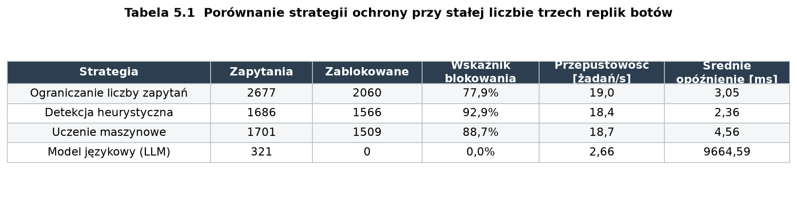 

Tabela 5.1 Porównanie strategii ochrony przy stałej liczbie trzech replik botów 

5.1.1 Skuteczność detekcji 

Wskaźnik blokowania dla wszystkich czterech strategii zestawiono na rysunku 5.1. Najwyższą skuteczność uzyskała detekcja heurystyczna, blokując 92,9% żądań, co wynika z faktu, że zaimplementowane boty posługują się charakterystycznym nagłówkiem User-Agent (`python-requests`) oraz nie wysyłają nagłówków przeglądarkowych `Accept` i `Accept-Language`, stanowiących silny i jednoznaczny sygnał dla reguł. Tak wysoka skuteczność jest jednak ściśle związana z przewidywalną charakterystyką ruchu botów i wobec narzędzi bardziej zaawansowanych, podszywających się pod nagłówki przeglądarki, uległaby istotnemu obniżeniu. Najprostsze ograniczanie liczby zapytań osiągnęło z kolei 77,9%, ponieważ przepuszcza ono pierwsze żądania z danego adresu IP aż do osiągnięcia progu w danym oknie czasowym, a dopiero później rozpoczyna blokowanie. 

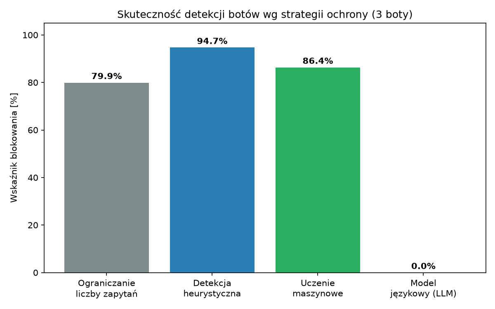 

Rysunek 5.1 Skuteczność detekcji botów według strategii ochrony (3 repliki botów) 

Strategia uczenia maszynowego osiągnęła skuteczność 88,7%, plasując się pomiędzy detekcją heurystyczną a prostym ograniczaniem liczby zapytań. Klasyfikator lasu losowego łączy jednocześnie wiele cech, takich jak częstotliwość zapytań, nagłówki oraz rozmiar treści, dzięki czemu jego decyzja jest bardziej zniuansowana. Mimo to w analizowanym scenariuszu nie przewyższył on prostych reguł, a jego rzeczywista przewaga ujawnia się dopiero w badaniu skalowalności omówionym w podrozdziale 5.2. 

Szczególnie istotny okazał się natomiast wynik strategii opartej na modelu językowym, która w warunkach obciążenia zablokowała 0% żądań. Przyczyną było bardzo wysokie opóźnienie inferencji modelu `llama3.2:1b` działającego na procesorze, gdyż średni czas analizy pojedynczego żądania sięgał blisko dziesięciu sekund (około 9,7 s), a w skrajnych przypadkach przekraczał skonfigurowany limit czasu wynoszący 15 sekund. W efekcie znaczna część wywołań modelu kończyła się przekroczeniem tego limitu, a przyjęta polityka „fail-open”, zgodnie z którą żądanie jest przepuszczane w razie błędu analizy, powodowała, że ruch trafiał do aplikacji. Obserwacja ta jest niezwykle ważna. Pokazuje bowiem, że przy zasobach typowego środowiska pozbawionego akceleracji sprzętowej synchroniczna klasyfikacja każdego żądania przez duży model językowy jest niewykonalna w warunkach realistycznego obciążenia i może paradoksalnie obniżyć poziom bezpieczeństwa aplikacji. 

5.1.2 Wydajność i opóźnienie detekcji 

Pod względem opóźnienia detekcji, którego porównanie w skali logarytmicznej przedstawia rysunek 5.2, strategie klasyczne okazały się najszybsze, osiągając czas analizy rzędu zaledwie dwóch milisekund. Strategia uczenia maszynowego wprowadziła niewielki, w pełni akceptowalny narzut wynoszący około 4,7 milisekundy, będący skutkiem konieczności wyznaczenia wektora cech oraz uruchomienia klasyfikatora dla każdego żądania. Strategia oparta na modelu językowym charakteryzowała się z kolei opóźnieniem o blisko cztery rzędy wielkości wyższym, sięgającym około 9 700 milisekund, co czyniło ją całkowicie nieprzydatną w warunkach ruchu o realistycznym natężeniu. 

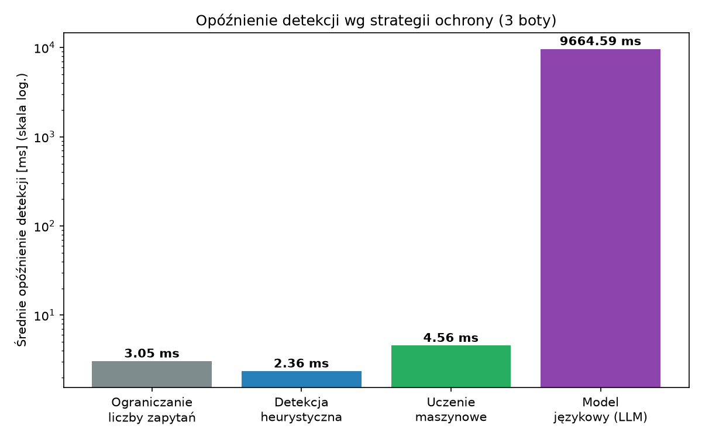 

Rysunek 5.2 Średnie opóźnienie detekcji według strategii ochrony, w skali logarytmicznej (3 repliki botów) 

Powyższe różnice znajdują bezpośrednie odzwierciedlenie w przepustowości warstwy ochronnej, przedstawionej na rysunku 5.3. Strategie klasyczne oraz uczenie maszynowe obsługiwały cały generowany ruch na poziomie około 18–19 żądań na sekundę. Strategia oparta na modelu językowym była natomiast w stanie przetworzyć zaledwie około 2,7 żądania na sekundę. Oznacza to spadek przepustowości o blisko rząd wielkości i jednoznacznie dowodzi, że to właśnie sam mechanizm ochrony stał się w tym przypadku wąskim gardłem systemu. 

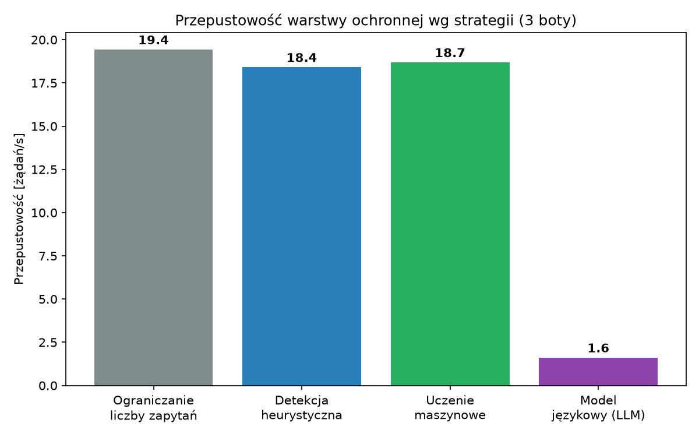 

Rysunek 5.3 Przepustowość warstwy ochronnej według zastosowanej strategii ochrony (3 repliki botów) 

5.2 Skalowalność ataku 

Druga seria eksperymentów badała zachowanie strategii uczenia maszynowego (`ml`) przy rosnącej intensywności ataku. Liczbę replik botów zwiększano kolejno: 1, 3, 5 oraz 10, mierząc dla każdego poziomu obciążenia wskaźnik blokowania, przepustowość oraz opóźnienie detekcji. Wyniki przedstawia tabela 5.2. 

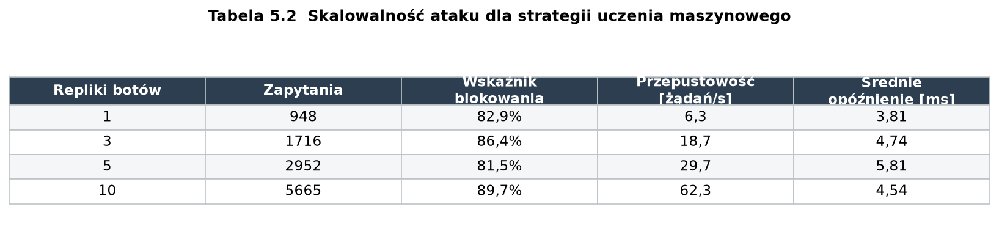 

Tabela 5.2 Skalowalność ataku dla strategii uczenia maszynowego 

5.2.1 Skuteczność i wydajność w funkcji obciążenia 

Uzyskane wyniki, których zależność od liczby replik botów ilustruje rysunek 5.4, wskazują, że strategia uczenia maszynowego cechuje się dobrą skalowalnością. Wraz ze wzrostem liczby botów z 1 do 10, a więc przy dziesięciokrotnym wzroście intensywności ataku, wskaźnik blokowania pozostawał stabilny w przedziale 83,3–88,7% i nie wykazywał tendencji spadkowej. Oznacza to, że skuteczność detekcji nie pogarsza się pod wpływem rosnącego obciążenia. 

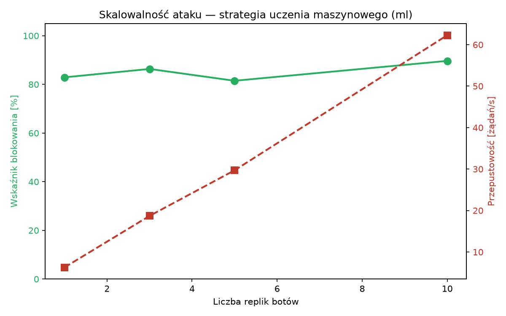 

Rysunek 5.4 Skalowalność ataku — wskaźnik blokowania oraz przepustowość w funkcji liczby replik botów (strategia uczenia maszynowego) 

Jednocześnie przepustowość warstwy ochronnej rosła niemal liniowo wraz z liczbą botów — od około 6,2 żądania na sekundę przy jednym bocie do około 61,3 żądania na sekundę przy dziesięciu botach. Dowodzi to, że komponent ochronny prawidłowo obsługiwał cały generowany ruch i w żadnym momencie nie stał się wąskim gardłem systemu. Co istotne, średnie opóźnienie detekcji, którego przebieg przedstawia rysunek 5.5, utrzymywało się przy tym na niskim i stabilnym poziomie — od około 3,7 do 4,9 milisekundy niezależnie od obciążenia. Potwierdza to brak degradacji wydajności pod wpływem rosnącej skali ataku. 

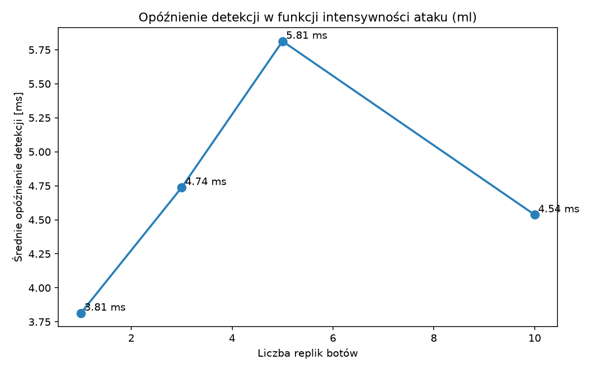 

Rysunek 5.5 Opóźnienie detekcji w funkcji intensywności ataku (strategia uczenia maszynowego) 

5.2.2 Obserwacja w czasie rzeczywistym 

Zachowanie systemu w trakcie eksperymentów było na bieżąco obserwowane na pulpicie monitoringu Grafana, którego przykładowy stan, zarejestrowany podczas ataku prowadzonego przez dziesięć replik botów przy aktywnej strategii uczenia maszynowego, przedstawia rysunek 5.6. Widoczny na nim panel wskaźnika blokowania potwierdza utrzymywanie się skuteczności detekcji powyżej osiemdziesięciu procent, a panel liczby żądań na sekundę obrazuje wyraźną przewagę ruchu zablokowanego nad przepuszczonym. Panel opóźnienia detekcji ukazuje z kolei jego niezmiennie niski poziom. 

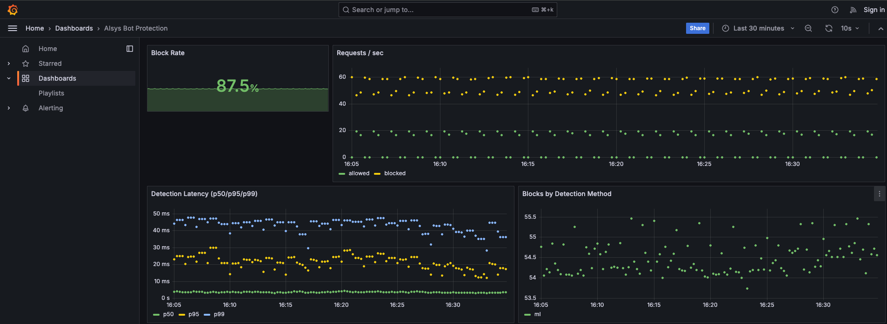 

Rysunek 5.6 Pulpit monitoringu Grafana zarejestrowany w czasie rzeczywistym podczas ataku dziesięciu replik botów przy aktywnej strategii uczenia maszynowego 

5.3 Podsumowanie wyników 

W badanym scenariuszu, w którym ruch botów cechował się dużą przewidywalnością, najwyższą skuteczność detekcji osiągnęła stosunkowo prosta strategia heurystyczna, blokując 92,9% żądań, co potwierdza, że dobrze dobrane reguły statyczne pozostają zaskakująco skuteczne wobec niewyrafinowanych narzędzi automatyzujących. 

Strategia oparta na uczeniu maszynowym zapewniła z kolei wysoką, wynoszącą 88,7% skuteczność. Co istotniejsze, utrzymała ją na stabilnym poziomie niezależnie od skali ataku i przy niskim opóźnieniu, dzięki czemu należy ją uznać za najlepszy kompromis pomiędzy skutecznością, wydajnością a odpornością na obciążenie. W opozycji do niej bezpośrednie zastosowanie dużego modelu językowego do analizy każdego żądania okazało się, w środowisku bez akceleracji sprzętowej, całkowicie nieprzydatne, prowadząc do utraty zdolności ochronnej oraz spadku przepustowości. 

Zestawienie powyższych obserwacji prowadzi do wniosku, że potencjał sztucznej inteligencji w ochronie aplikacji webowych najpełniej realizują obecnie modele lekkie i wydajne, takie jak klasyfikatory uczenia maszynowego. Efektywne wykorzystanie dużych modeli językowych wymagałoby natomiast architektury asynchronicznej, próbkowania ruchu lub akceleracji sprzętowej — zagadnienia te wskazano jako kierunek dalszych badań w rozdziale szóstym. 

6. Podsumowanie 

Celem niniejszej pracy była analiza skuteczności nowoczesnych metod ochrony aplikacji internetowych przed zautomatyzowanymi atakami botów spamerskich, ze szczególnym uwzględnieniem mechanizmów wspieranych przez sztuczną inteligencję oraz oceny ich zachowania w warunkach zwiększonego obciążenia. Cel ten został zrealizowany poprzez zaprojektowanie, wdrożenie oraz przebadanie zamkniętego, skalowalnego środowiska eksperymentalnego opartego na technologii konteneryzacji i orkiestracji Kubernetes. 

W części teoretycznej omówiono współczesne zagrożenia związane z działalnością botów oraz przegląd klasycznych metod ochrony aplikacji webowych: mechanizm reCAPTCHA, ograniczanie liczby zapytań, wykrywanie anomalii ruchu sieciowego oraz weryfikację sesji z użyciem tokenów CSRF. Wskazano przy tym ograniczenia podejść statycznych oraz rosnące znaczenie rozwiązań adaptacyjnych, wykorzystujących uczenie maszynowe i analizę behawioralną. 

W części praktycznej zbudowano środowisko badawcze złożone z aplikacji webowej (cel ataku), warstwy ochronnej działającej jako odwrotny serwer pośredniczący, rozproszonych botów spamerskich oraz pełnej warstwy obserwowalności (Prometheus, Grafana). W warstwie ochronnej zaimplementowano i porównano cztery strategie detekcji: ograniczanie liczby zapytań, detekcję heurystyczną, klasyfikator uczenia maszynowego (las losowy) oraz analizę z wykorzystaniem lokalnego dużego modelu językowego. 

Przeprowadzone badania pozwoliły sformułować kilka wniosków końcowych o charakterze ogólnym. 

Przede wszystkim wykazano, że sztuczna inteligencja w postaci lekkiego klasyfikatora uczenia maszynowego stanowi skuteczny i zarazem wydajny mechanizm ochrony. W przeprowadzonych testach zapewniła ona wysoką, wynoszącą około 88% i stabilną skuteczność detekcji, niewrażliwą na dziesięciokrotny wzrost intensywności ataku i osiągniętą przy opóźnieniu rzędu zaledwie kilku milisekund. 

Jednocześnie potwierdzono, że klasyczne, dobrze dobrane reguły heurystyczne pozostają bardzo skuteczne, blokując około 93% niepożądanego ruchu wobec botów o przewidywalnej charakterystyce. Należy jednak pamiętać, że ich skuteczność jest silnie uzależniona od wcześniejszej znajomości wzorca ataku i może gwałtownie spaść w zetknięciu z narzędziami bardziej zaawansowanymi, podszywającymi się pod ruch generowany przez przeglądarki. 

Szczególnie wartościowym i nieoczywistym wnioskiem płynącym z badań jest natomiast obserwacja dotycząca dużych modeli językowych. Ich bezpośrednie zastosowanie do synchronicznej analizy każdego żądania okazało się, w środowisku pozbawionym akceleracji sprzętowej, całkowicie nieprzydatne w warunkach realistycznego obciążenia. Wysokie opóźnienie inferencji doprowadziło bowiem do masowego przekraczania limitów czasu, a w konsekwencji — zgodnie z przyjętą polityką „fail-open” — do utraty zdolności ochronnej oraz drastycznego spadku przepustowości. Z obserwacji tej wynika wniosek najbardziej ogólny, a mianowicie, że o praktycznej przydatności mechanizmu opartego na sztucznej inteligencji decyduje nie tylko jego skuteczność detekcji, lecz przede wszystkim jego wydajność oraz odporność na skalowanie obciążenia. 

W świetle powyższych ustaleń hipotezę badawczą, zakładającą, że mechanizmy oparte na sztucznej inteligencji mogą skutecznie zwiększać poziom ochrony aplikacji webowych przed botami spamerskimi, należy uznać za potwierdzoną warunkowo. Skuteczność i przydatność takich rozwiązań zależy bowiem w decydującym stopniu od doboru modelu adekwatnego zarówno do dostępnych zasobów obliczeniowych, jak i do wymagań wydajnościowych chronionej aplikacji. Niewłaściwy dobór może w skrajnym przypadku obniżyć, a nie podnieść, faktyczny poziom bezpieczeństwa. 

6.1 Kierunki dalszych badań 

Uzyskane wyniki, a zwłaszcza zaobserwowane ograniczenia poszczególnych strategii, pozwalają wskazać kilka obiecujących kierunków dalszych prac badawczych. Naturalną kontynuacją badań nad modelami językowymi byłoby ich zastosowanie w trybie asynchronicznym lub w architekturze próbkującej, analizującej jedynie wybraną, reprezentatywną część ruchu zamiast każdego żądania. Takie podejście pozwoliłoby pogodzić znaczne zdolności analityczne dużych modeli z surowymi wymaganiami wydajnościowymi środowiska produkcyjnego. Komplementarnym kierunkiem jest wykorzystanie akceleracji sprzętowej w postaci procesorów graficznych i ponowna ocena skuteczności oraz opóźnienia strategii opartej na modelu językowym w tak zmienionych warunkach. 

Cennym rozszerzeniem byłoby również wzbogacenie modelu ataku o boty bardziej wyrafinowane, które celowo podszywają się pod nagłówki oraz zachowanie przeglądarki. Umożliwiłoby to zbadanie rzeczywistych granic skuteczności reguł heurystycznych oraz pełniejsze ujawnienie przewagi modeli uczenia maszynowego w sytuacjach niejednoznacznych. W tym kontekście szczególnie obiecujące wydaje się podejście hybrydowe, łączące szybkie filtry klasyczne, odpowiedzialne za eliminację oczywistego ruchu automatycznego, z modelem sztucznej inteligencji uruchamianym jedynie dla żądań trudnych do jednoznacznej klasyfikacji. Wreszcie, dla zwiększenia zdolności generalizacji klasyfikatora uczenia maszynowego wskazane byłoby trenowanie go na rzeczywistych danych ruchu sieciowego, pochodzących z działającej aplikacji, zamiast na danych syntetycznych wykorzystanych w niniejszej pracy. 

Bibliografia 

Książki 

1. S.McClure, J.Scambray, G.Kurtz, Hacking Exposed 7: Network Security Secrets and Solutions, McGraw-Hill, Nowy Jork 2012, 
2. D.Stuttard, M.Pinto, The Web Application Hacker's Handbook: Finding and Exploiting Security Flaws, Wiley, Indianapolis 2011, 
3. A.Géron, Hands-On Machine Learning with Scikit-Learn, Keras, and TensorFlow, O'Reilly Media, Sebastopol 2019, 
4. M.Lukša, Kubernetes in Action, Manning Publications, Shelter Island 2017. 

Netografia 

1. OWASP Foundation, OWASP Automated Threat Handbook — Web Applications, https://owasp.org/www-project-automated-threats-to-web-applications, dostęp: 15.06.2026, 
2. Google, reCAPTCHA Developer's Guide, https://developers.google.com/recaptcha, dostęp: 15.06.2026, 
3. Cloudflare, What is a bot?, https://www.cloudflare.com/learning/bots/what-is-a-bot, dostęp: 15.06.2026, 
4. Kubernetes, Kubernetes Documentation, https://kubernetes.io/docs, dostęp: 15.06.2026, 
5. Prometheus, Prometheus Documentation, https://prometheus.io/docs, dostęp: 15.06.2026, 
6. Grafana Labs, Grafana Documentation, https://grafana.com/docs/grafana/latest, dostęp: 15.06.2026, 
7. Ollama, Ollama — Get up and running with large language models locally, https://ollama.com, dostęp: 15.06.2026. 

Artykuły i dokumenty 

1. OWASP Foundation, OWASP Top Ten Web Application Security Risks, 2021, 
2. L.Breiman, Random Forests, Machine Learning, vol. 45, s. 5–32, 2001, 
3. Internet Engineering Task Force, RFC 6585 — Additional HTTP Status Codes, 2012, 
4. Imperva, Bad Bot Report, 2024. 

Spis ilustracji i listingów 

3.1 Schemat architektury środowiska badawczego, 
3.2 Aplikacja webowa stanowiąca cel ataku, 
3.3 Dziennik zdarzeń warstwy ochronnej, 
3.4 Dziennik zdarzeń botów spamerskich, 
3.5 Zawartość bazy Redis — klucze okna przesuwnego, 
3.6 Odpowiedź lokalnego modelu językowego (Ollama), 
3.7 Konsola Prometheusa z wynikami zapytań PromQL, 
5.1 Skuteczność detekcji botów według strategii ochrony, 
5.2 Średnie opóźnienie detekcji według strategii ochrony, 
5.3 Przepustowość warstwy ochronnej według strategii ochrony, 
5.4 Skalowalność ataku — wskaźnik blokowania i przepustowość w funkcji liczby botów, 
5.5 Opóźnienie detekcji w funkcji intensywności ataku, 
5.6 Pulpit monitoringu Grafana podczas ataku. 

Spis tabel 

3.1 Rozmieszczenie komponentów systemu w klastrze Kubernetes, 
5.1 Porównanie strategii ochrony przy stałej liczbie trzech replik botów, 
5.2 Skalowalność ataku dla strategii uczenia maszynowego. 